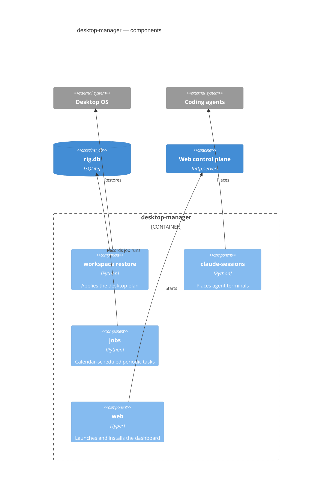

```mermaid
C4Component
title desktop-manager — components
System_Ext(desktop, "Desktop OS")
System_Ext(agents, "Coding agents")
ContainerDb(db, "rig.db", "SQLite", $link="../rig-db.md")
Container(web, "Web control plane", "http.server")

Container_Boundary(dm, "desktop-manager") {
  Component(restore, "workspace restore", "Python", "Applies the desktop plan")
  Component(sessions, "claude-sessions", "Python", "Places agent terminals")
  Component(jobs, "jobs", "Python", "Calendar-scheduled periodic tasks")
  Component(webcli, "web", "Typer", "Launches and installs the dashboard")
}

Rel(restore, desktop, "Restores")
Rel(sessions, agents, "Places")
Rel(jobs, db, "Records job runs")
Rel(webcli, web, "Starts")
```
