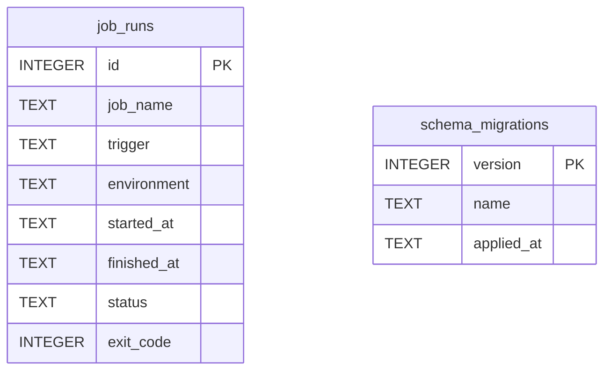

```mermaid
erDiagram
  job_runs {
    INTEGER id PK
    TEXT job_name
    TEXT trigger
    TEXT environment
    TEXT started_at
    TEXT finished_at
    TEXT status
    INTEGER exit_code
  }
  schema_migrations {
    INTEGER version PK
    TEXT name
    TEXT applied_at
  }
```

Linked from both the web and the desktop-manager component views; `rig c4 check` reports it as `fan-in`.
