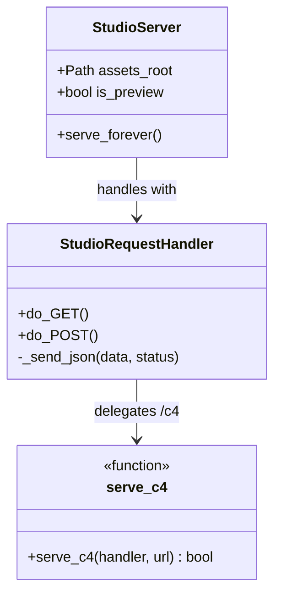

```mermaid
classDiagram
  class StudioServer {
    +Path assets_root
    +bool is_preview
    +serve_forever()
  }
  class StudioRequestHandler {
    +do_GET()
    +do_POST()
    -_send_json(data, status)
  }
  class serve_c4 {
    <<function>>
    +serve_c4(handler, url) bool
  }
  StudioServer --> StudioRequestHandler : handles with
  StudioRequestHandler --> serve_c4 : delegates /c4
  click serve_c4 href "components.md"
```

The code level is where C4 says to stop drawing and link to the code: `resource` points at the file.
