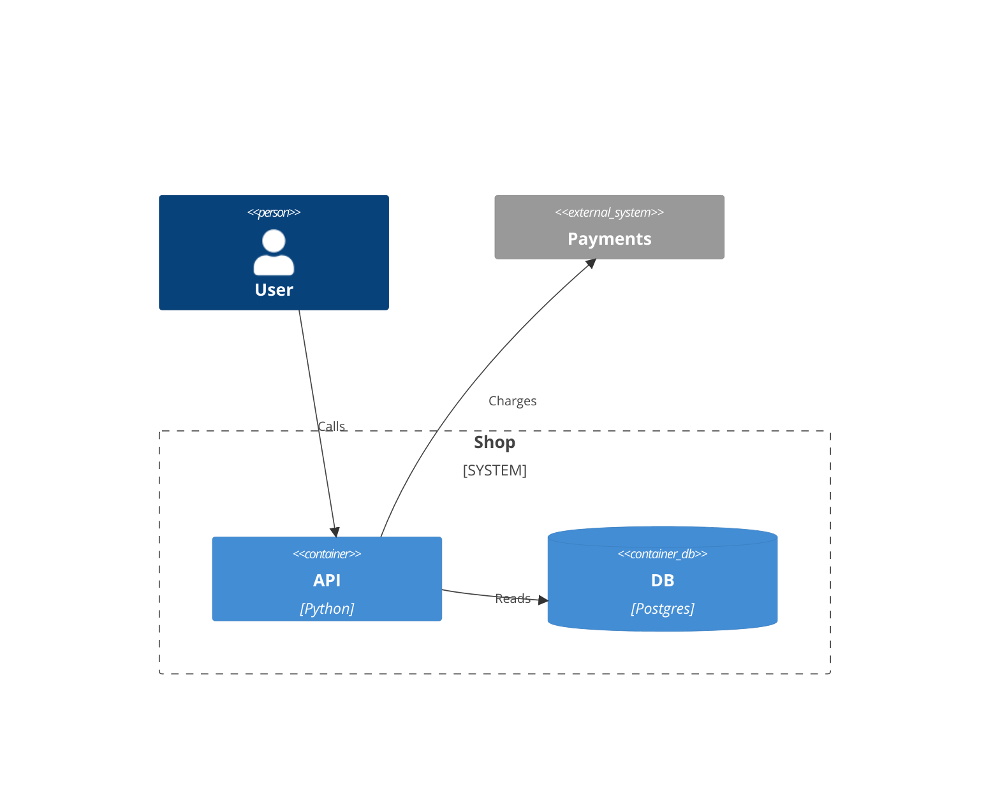

```mermaid
C4Container
Person(user, "User")
System_Ext(pay, "Payments")
System_Boundary(shop, "Shop") {
  Container(api, "API", "Python", $link="../ctx.md")
  ContainerDb(db, "DB", "Postgres")
}
Rel(user, api, "Calls")
Rel(api, db, "Reads")
Rel(api, pay, "Charges")
```

Text.
